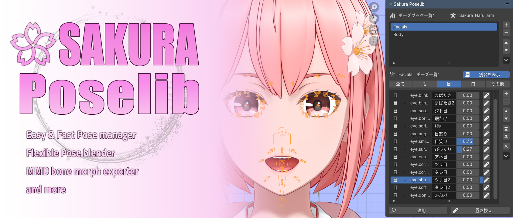

# Sakura Poselib

***Yet another pose library with a lot of handy features.***

## Overview

- Adds simple and handy pose libraries to armatures.
- Quickly add/update/preview poses form context menu.
- Blend multiple poses with sliders.
- Supports Blender's animation system. Keyframe your poses to make character animations!
- Compatible with mmd_tools, PMX Editor via import/export functions.

## Online Document

- [English](https://kafuji.github.io/Sakura-Creative-Suite/en/addons/Sakura_PoseLib/)
- [日本語](https://kafuji.github.io/Sakura-Creative-Suite/ja/addons/Sakura_PoseLib/)

## Change Log

- 2024/11/14: v.1.2.5
  - Added blender_manifest.toml for Blender 4.2.
    - This add-on is now work as well as an extension (for Blender 4.2 or later).
  - Licence changed to GPL v3.

- 2024/11/07: v.1.2.4
  - Save to JSON: Added the "Use Armature Space" option to save poses in armature space (default is True).
    - When enabled, bone transforms are saved in armature space, which is useful for sharing poses across different armatures with varying bone rolls.
    - When disabled, bone transforms are saved in bone local space, matching previous versions (Blender’s default behavior).
  - Load from JSON/CSV: Removed the automatic category-setting behavior for loading poses.
  - PoseBook menu: Tweaked for more usability.

- 2024/08/03: v1.2.3
  - Fixed: Creating new posebook no longer reset current pose.
  - Optimized internal pose data handling.

- 2024/07/22: v1.2.2
- Add/Replace/Duplicate Pose:
  - Fixed errors when adding / replacing pose on a armature without animation_data.
  - Automatically makes new/target pose applied after operator is executed.
- General:
  - Automatically update current pose to match pose values when changing active pose book in Poselib.
  - In Pose list, `Move Pose` operator is now disabled when there's no active pose.
  - Tweaked Pose Preview overlay text position to better visibility.
  - Better language translation for Add/Replace pose context menu.

- 2024/07/19: v1.2.1
  - Sakura Poselib panel was shown on object data tab other than Armature data (eg. Mesh data tab). It is now only on Armature data tab.
- Added 'bl_ext.blender_org.mmd_tools' to check mmd_tools, to work in Blender 4.2.

- 2024/07/18: v1.2.0
  - Added Animation Mode to support using Poselib with Blender's animation system.
    - To use it, press 'Enable Animation' button in the Book list panel.
  - Added support for Linked Library Armature object.
    - Now you can use Poselib with linked library armature object.
  - Minor bugfixes and feature improvements.

- 2024/07/16: v1.1.1
  - Pose List:
    - Added 'Duplicate Pose' function.
    - 'Add Pose' operator now inserts new pose next to the active pose.
      - This behaviour can be changed in the operator options (Insert/Append/Prepend).
  - General:
    - All features are now disalbed on Linked/Overrided Library armature objects to prevent causing errors.
      - Library armature will be supported in the future update.

- 2024/06/03 v1.1.0
  - Pose List:
    - Added 'Batch Rename Poses' function.
    - Added Display Settings. Buttons for Apply, Replace, Select Bones are now switchable.
    - Auto Set Pose Category operator now handles 'eyelid', 'eyelids' as EYE category.
    - Minor UI improvements.
  - Add Pose Operator:
    - Fixed bug where pose category was not set when creating new pose.
    - Category is now auttomatically set by using the category_filter of active pose book.
  - Preferences:
    - Added Pose List Display Settings.

- 2024/04/08 v1.0.1
  - Fixed an issue that caused error on the add-on load in MacOS/Linux. (Fixed how to handle file path)

## Disclaimer

The author is not responsible for any results from using this add-on. Please use it at your own risk.

## License

[GPL 3.0](https://www.gnu.org/licenses/gpl-3.0.html)

---

## Author

- **Kafuji Sato** - VR Character Workshop
  - [Twitter](https://twitter.com/kafuji)
  - [GitHub](https://kafuji.github.io)
  - [Fantia](https://fantia.jp/fanclubs/3967)
  - [Fanbox](https://kafuji.fanbox.cc/)
  - [Gumroad](https://kafuji.gumroad.com)
  - [Blender Market](https://blendermarket.com/creators/kafuji)

## Copyright

© 2021-2024 Kafuji Sato
